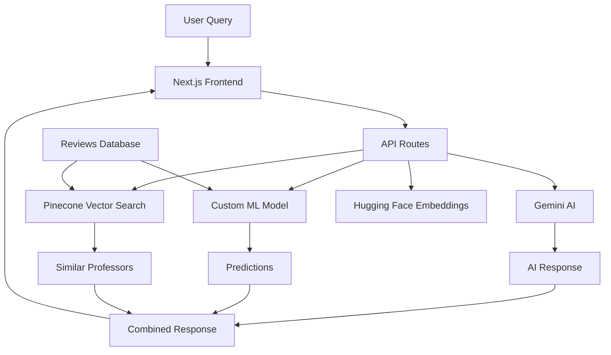

# 🎓 Rate My Professor AI

An intelligent professor rating and recommendation system powered by AI, machine learning, and vector search technology.


## 🌟 Features

### 🤖 AI-Powered Intelligence
- **Custom ML Models**: Scikit-learn based prediction system
- **Semantic Search**: Vector embeddings with Pinecone
- **Smart Recommendations**: Context-aware professor suggestions
- **Sentiment Analysis**: Review sentiment and difficulty prediction

### 💬 Interactive Chat Assistant
- **Natural Language Queries**: Ask questions in plain English
- **Contextual Responses**: AI understands professor-specific questions
- **Markdown Support**: Rich formatted responses
- **Real-time Predictions**: Instant AI insights

### 📊 Advanced Analytics
- **Professor Profiles**: Detailed analytics for each professor
- **Rating Distributions**: Visual rating breakdowns
- **Difficulty Metrics**: AI-predicted course difficulty
- **Consistency Scores**: Teaching quality consistency analysis
- **Tag Extraction**: Automatic keyword extraction from reviews

### 🎨 Modern UI/UX
- **Dark Mode**: Toggle between light and dark themes
- **Responsive Design**: Works on all device sizes
- **Material Design**: Clean, modern interface
- **Smooth Animations**: Framer Motion powered transitions

## 🚀 Live Demo

**🌐 [Try Rate My Professor AI](https://rate-my-professor-e6gy2670r-vatsa-chhetas-projects.vercel.app)**

## 🛠️ Tech Stack

### Frontend
- **Framework**: Next.js 14 (App Router)
- **UI Library**: Material-UI (MUI) 5
- **Styling**: Tailwind CSS + Custom CSS
- **Animations**: Framer Motion
- **Markdown**: React Markdown with GFM support

### Backend & AI
- **Runtime**: Node.js (Serverless Functions)
- **AI Models**: Google Gemini 1.5-flash
- **ML Framework**: Scikit-learn (Python)
- **Vector Database**: Pinecone
- **Embeddings**: Hugging Face Transformers
- **Text Processing**: NLTK, TF-IDF

### Deployment & Infrastructure
- **Platform**: Vercel
- **Database**: JSON file storage + Vector DB
- **APIs**: RESTful API routes
- **Environment**: Serverless architecture

## 🏗️ Architecture



## 📦 Installation

### Prerequisites
- Node.js 18+ 
- Python 3.9+
- npm or yarn
- API keys (Gemini, Pinecone, Hugging Face)

### 1. Clone Repository
```bash
git clone https://github.com/Vatsal315/rate-my-professor-ai.git
cd rate-my-professor-ai
```

### 2. Install Dependencies
```bash
# Install Node.js dependencies
npm install

# Install Python dependencies
pip install -r requirements.txt
```

### 3. Environment Setup
Create `.env.local` in the root directory:
```env
GEMINI_API_KEY=your_gemini_api_key_here
PINECONE_API_KEY=your_pinecone_api_key_here  
HUGGINGFACE_API_TOKEN=your_huggingface_token_here
```

### 4. Database Setup
```bash
# Create Pinecone index (via their console)
# Index name: professors-index
# Dimensions: 1024
# Metric: cosine

# Initialize vector database
curl -X POST http://localhost:3000/api/reindex
```

### 5. Train AI Model
```bash
# Option 1: Via UI
# Visit http://localhost:3000/train and click "Start Training"

# Option 2: Command line
python3 train_model.py
```

### 6. Run Development Server
```bash
npm run dev
```

Visit `http://localhost:3000` to see the application.

## 🔑 API Keys Setup

### Google Gemini AI
1. Visit [Google AI Studio](https://makersuite.google.com/app/apikey)
2. Create a new API key
3. Add to `.env.local` as `GEMINI_API_KEY`

### Pinecone Vector Database
1. Sign up at [Pinecone](https://pinecone.io)
2. Create a new index: `professors-index` (dimension: 1024)
3. Get API key from dashboard
4. Add to `.env.local` as `PINECONE_API_KEY`

### Hugging Face
1. Sign up at [Hugging Face](https://huggingface.co)
2. Create access token in settings
3. Add to `.env.local` as `HUGGINGFACE_API_TOKEN`

## 📚 Usage

### Adding Reviews
1. Navigate to `/upload`
2. Fill in professor details and review
3. Submit to add to database

### Chatting with AI
1. Go to `/chat`
2. Ask questions like:
   - "Who teaches Computer Science well?"
   - "Tell me about Dr. Jane Smith"
   - "Which professors are easy graders?"

### Training Custom Model
1. Visit `/train`
2. Click "Start Training"
3. Wait for completion
4. Model saves automatically

### Viewing Analytics
1. Browse `/allreviews` for all professors
2. Click any professor name for detailed analytics
3. See AI predictions, rating distributions, and insights

## 🧠 Machine Learning Pipeline

### Data Processing
- **Text Preprocessing**: NLTK tokenization and stemming
- **Feature Engineering**: TF-IDF vectorization + categorical encoding
- **Synthetic Data**: Generated training examples for better model performance

### Model Architecture
- **Algorithm**: Random Forest Regressor (optimized for small datasets)
- **Features**: Review text (TF-IDF) + professor/subject metadata
- **Outputs**: Rating prediction, difficulty score, confidence metrics

### Training Process
1. Load reviews from `data/reviews.json`
2. Generate synthetic training data (30 additional examples)
3. Extract TF-IDF features from review text
4. Train separate models for rating and difficulty prediction
5. Save models to `models/` directory

## 🚀 Deployment

### Vercel (Recommended)
```bash
# Install Vercel CLI
npm i -g vercel

# Deploy
vercel --yes

# Add environment variables in Vercel dashboard
```

### Manual Deployment
1. Build the application: `npm run build`
2. Deploy `out/` folder to your hosting provider
3. Set up environment variables
4. Configure serverless functions for API routes

## 🔧 Configuration

### Vercel Settings (`vercel.json`)
```json
{
  "functions": {
    "app/api/train/route.js": {
      "maxDuration": 300
    },
    "app/api/predict/route.js": {
      "maxDuration": 60
    }
  },
  "build": {
    "env": {
      "PYTHON_VERSION": "3.9"
    }
  }
}
```

### Next.js Configuration
- App Router architecture
- API routes for backend functionality
- Client/Server component separation
- Optimized for serverless deployment

## 🧪 Testing

### Run Tests
```bash
# Test ML model
python3 train_model.py

# Test API endpoints
npm run dev
curl -X POST http://localhost:3000/api/chat -d '{"message":"test"}'
```

### Performance Benchmarks
- **Model Training**: ~2 seconds (44 reviews)
- **Prediction Speed**: ~1-2 seconds per query
- **Vector Search**: ~200ms average
- **Page Load**: ~500ms initial, ~100ms cached

## 🤝 Contributing

We welcome contributions! Here's how:

1. **Fork the repository**
2. **Create feature branch**: `git checkout -b feature/amazing-feature`
3. **Commit changes**: `git commit -m 'Add amazing feature'`
4. **Push to branch**: `git push origin feature/amazing-feature`
5. **Open Pull Request**

### Development Guidelines
- Follow Next.js best practices
- Use TypeScript for new components
- Add tests for new features
- Update documentation
- Ensure responsive design

## 📄 License

This project is licensed under the MIT License - see the [LICENSE](LICENSE) file for details.

## 🙏 Acknowledgments

- **Next.js Team** - Amazing React framework
- **Material-UI** - Beautiful component library  
- **Google AI** - Powerful language models
- **Pinecone** - Efficient vector database
- **Hugging Face** - Open-source ML models
- **Vercel** - Seamless deployment platform

## 📞 Support

- **GitHub Issues**: [Report bugs or request features](https://github.com/Vatsal315/rate-my-professor-ai/issues)
- **Documentation**: Check our [Wiki](https://github.com/Vatsal315/rate-my-professor-ai/wiki)

## 🎯 Roadmap

### Phase 1 ✅
- [x] Basic professor rating system
- [x] AI-powered chat assistant
- [x] Custom ML model training
- [x] Vector search integration
- [x] Modern UI with dark mode

### Phase 2 🚧
- [ ] User authentication system
- [ ] Advanced filtering and search
- [ ] Professor comparison tools
- [ ] Mobile app development
- [ ] Real-time notifications

### Phase 3 📋
- [ ] Multi-university support
- [ ] Social features and comments
- [ ] Advanced analytics dashboard
- [ ] API for third-party integrations
- [ ] Machine learning model improvements

---

**Built with ❤️ by Vatsal Chheta**

**⭐ Star this repo if you find it helpful!**